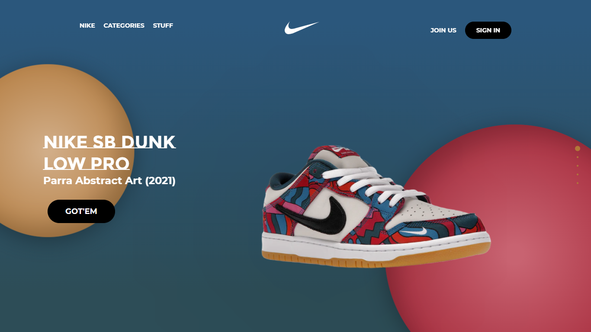
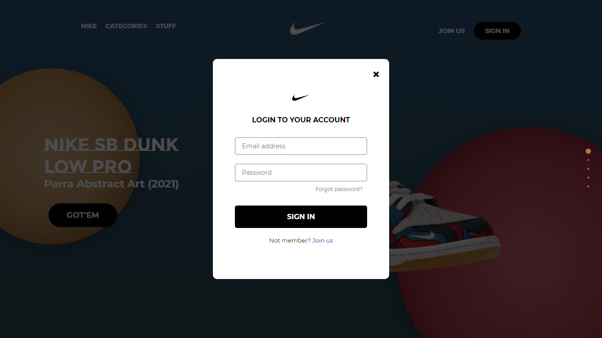

# Nike UI Template




<p align="center">
  <span>Template | UI | <a href="https://github.com/alvarotrigo/fullPage.js">FullPage.js</a></span>
</p>

---
[](https://opensource.org/licenses/Apache-2.0)


**Important:** Made with [FullPage.js](https://github.com/alvarotrigo/fullPage.js)

- Preview: [Demo online](https://zhenglinlei.github.io/nike-web-template/)
- Data Source: [Nike](https://nike.com) | [StockX](https://stockx.com) 
- [Folder with images](./source)


## Javascript fullscreen deploy

```Javascript

    // CALL
     var myFullpage = new fullpage('#fullpage', {
        navigation: true,
        navigationPosition: 'right',
        showActiveTooltip: true,
        slidesNavigation: true,
        slidesNavPosition: 'bottom',
        loopBottom: true,
        loopTop: true,
        controlArrows: true,
     });
     
     

```


### Love this repo? Give us a star ⭐

<a href="./">
  
</a>